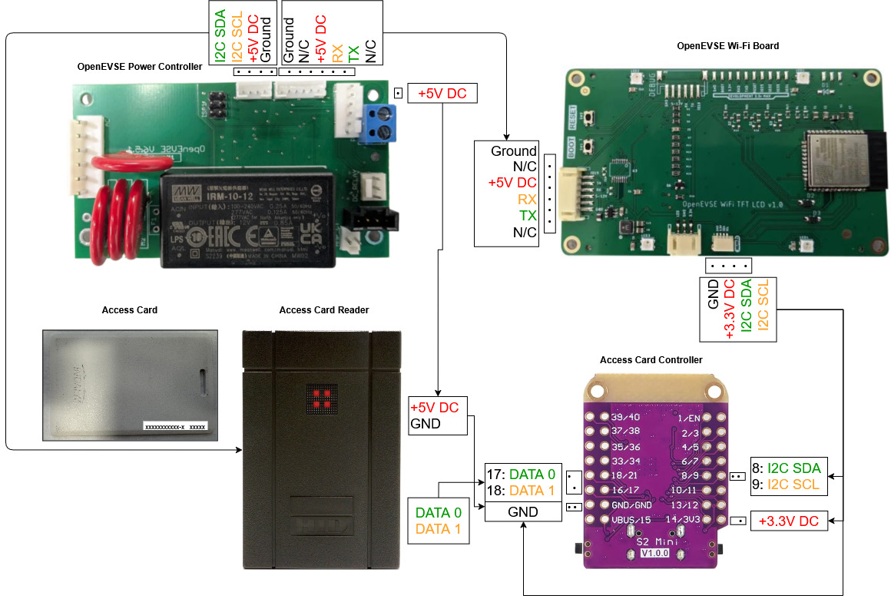

# Weigand I2C Access Card Reader 

• Works with the base [OpenEVSE FW](https://github.com/OpenEVSE/openevse_esp32_firmware)  
• All you need is the Card Reader and an ESP32 Board  
• Made for 26 bit Weigand Cards, can be configured for others  
• Made to be compilied and uploaded with PlatformIO

Wiring Guide:

